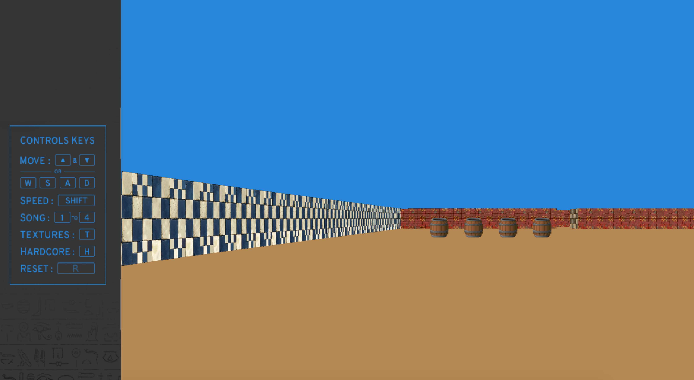
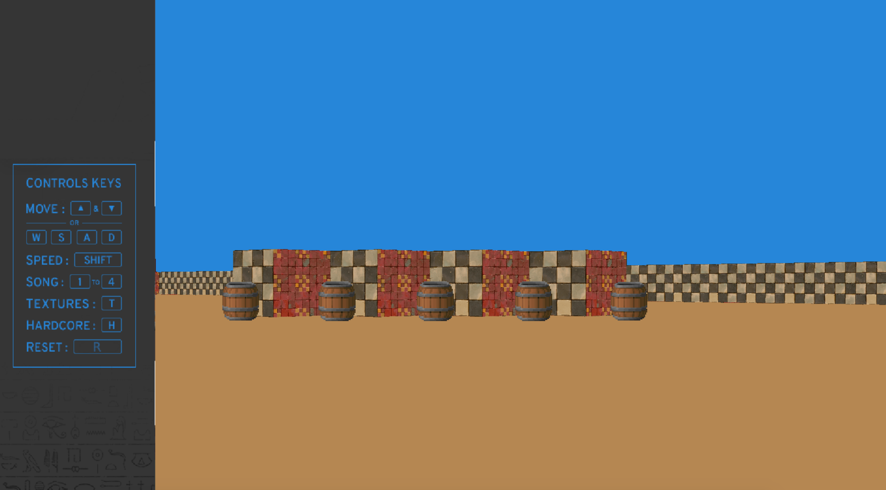
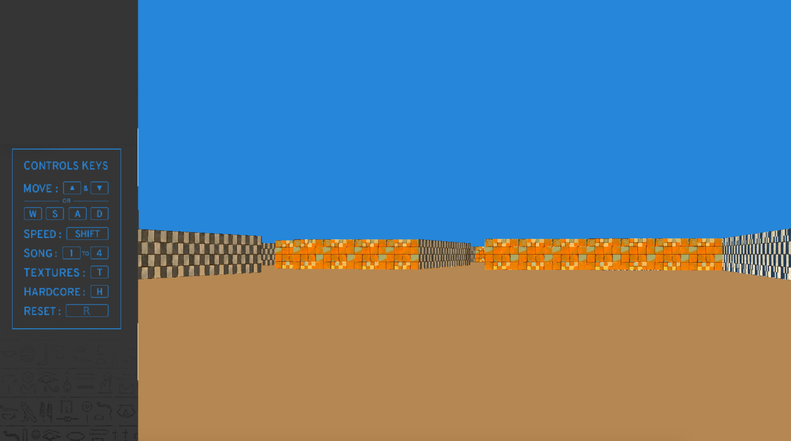

## Cub3d

### Description

This project is all about exploring the ray-casting's rendering techniques to create a 3D perspective in a 2D map .
So the main objectives are similar to all this first year’s objectives: Rigor, use of C, use
of basic algorithms, information research, data mining etc.

As a graphic design project, Cub3D will enable you to solidify your skills in this area:
windows, colors, events, fill shapes etc.

**Requirements:**

Mac OS X Mojave(10.14.6) or higher

**Installation and launch:**

* `git clone https://github.com/MoBoustta/Cub3d.git`
* `cd Cub3D`
* `make`
* `./Cub3D maps/map.cub`

**Keys:**

* `Arrows - moving`
* `Shift + Arrows - sprint`
* `1->4 - mute music`
* `T - Show/Hide textures`

**Note:**

You can get a screenshot of the game in bmp format by providing a third argument "--save"

[]
 

